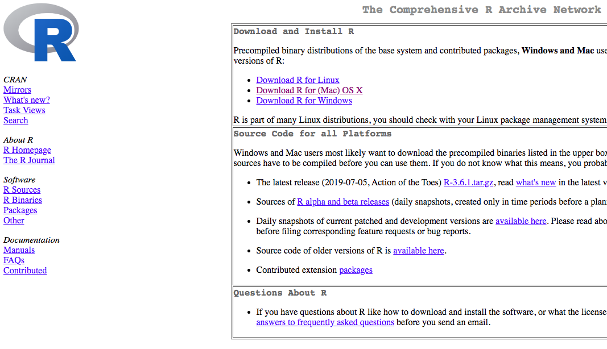
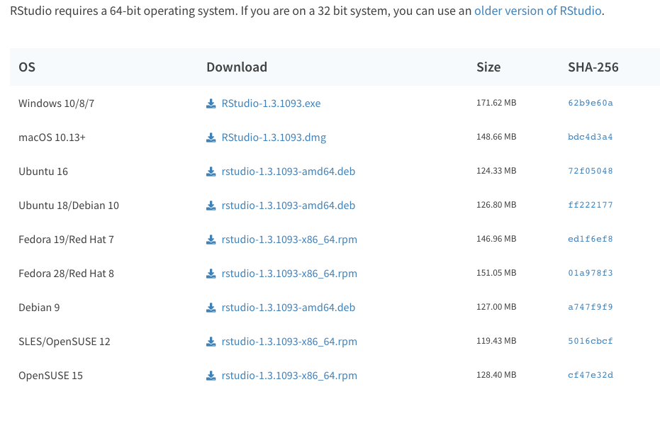
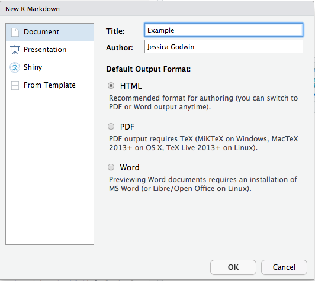
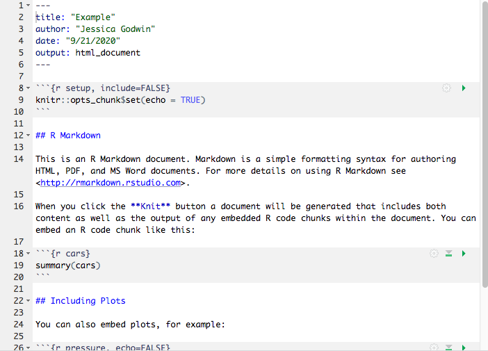

```{r setup, echo = FALSE}
knitr::opts_chunk$set(echo = TRUE)
knitr::opts_knit$set(root.dir = '~/Dropbox/Workshops/IntrotoRII/')
```

# Getting started 
## Download R

What is `R`? Open-source, free, stastical computing software.

Go to the [R website](https://cran.r-project.org/), and download the appropriate software for your operating system.



## Download RStudio

What is Rstudio? A nice GUI (graphical user interface) for writing code, analyzing data and building packages with `R`.

Go to the [RStudio website](https://rstudio.com/products/rstudio/download/#download). and download the appropriate software for your operating system.



## Rstudio Layout

Rstudio has four main panels that allow you to organize your code and have a better user experience developing and using `R` code: 

  * Source panel: where scripts are edited
  * Console panel: where code is executed and output is printed
  * Environment panel: where objects are stored
  * Files/Plots/Help: navigate files and folders, view plots, read and access help documentation for packages and functions


# R Markdown

Markdown is a simple formatting syntax for authoring HTML, PDF, and MS Word documents. For more details on using R Markdown see <http://rmarkdown.rstudio.com>. RMarkdown is a nice program within RStudio that allows us to typset documents and incorporate code and output. This is helpful for writing labs for you all to follow along with, but also to create reproducible and replicable research. It allows you to avoid writing scripts to produce all your output and then copy and pasting that output into a word processing software which may induce unnecessary errors in your work.

Go to File $\rightarrow$ New File $\rightarrow$ R Markdown. Select `Knit to HTML`



It will open up a new template .Rmd file for you to begin editing that will look like this:\



When you click the **Knit** button a document will be generated that includes both content as well as the output of any embedded R code chunks within the document. You can embed an R code chunk like this:

```{r knit_ex, eval = FALSE}
data(cars)
summary(cars)
```


A handy Rstudio/R Markdown cheatsheet can be found here <https://rstudio.com/wp-content/uploads/2016/03/rmarkdown-cheatsheet-2.0.pdf>. It gives summaries of the most used Markdown syntax aspects (e.g. headings/subheadings, bullet lists, numbered lists), the types of files R Markdown can create and examples of how R and R Markdown interact.

This is an example of an an R Markdown file that will be used to create a .html file. This is the best option if you don't have much math to write or do not need to share a .pdf.

## Why use R Markdown?

* Reproducibility: the results in the final come directly from the code include in the file
* Replicability: a collaborator or another researcher or student can directly replicate your analysis using the code in the chunks and there is room for much more commentary than in a regular script file.
* Debugging: every time you knit a .Rmd file, it executes the code from start to finish in a clean environment. it will not compile if there are errors in the \tt{R} code, the Markdown syntax or, if we are making a .pdf, the \LaTeX code.

## Chunks

While not nicely named, R code can be included in an R Markdown file in what we call a "chunk". Properties of the chunk are adjusted within the curly braces. The cheatsheet under the heading "Embed code with knitr syntax". The most common arguments I use are


  *  `echo`: logical argument determining whether the code in the subsequent chunk will be printed in the document created
  *  `eval`: logical argument determining whether or not the code in the subsequent chunk will be evaluated by `{R}$ or just printed in the document.
  *  `fig.cap`: provides a caption for a figure
  *  `fig.align`: aligns figure on "left", "right" or "center"

```{r pressure, echo=FALSE, fig.align = 'center', fig.cap = "For example, this figure was created with `echo = FALSE` and `eval = TRUE`."}
plot(pressure)
```

Chunks allow you to break up your code into smaller pieces that a reader can understand. It's great for writing reports/homeworks so that you can include code immediately followed by its output.\

## `purl()`

You can use the function `purl()` on a .Rmd document and it will create a new `.R` file with only the R code in the chunks. Copy and paste the following code line by line into your document to create a document called `IntroToRII_20231024.R` containing only the `R` code in this document.

```{r, eval = F}
install.packages('knitr')
library(knitr)
purl('IntroToRII_20231024.Rmd')
```

## Formatting

All of this is available on the cheat sheet, but here we will briefly cover basic text and document formatting.

### Bold/Italics
Use asterisks (`*`) around a word or phrase to make it *italicized*.

Use double asterisks (`**`) around a word or phrase to make it **bold**.

In R Markdown, these formatting tools will create highlighted text.

### Math mode

If you want to write equations you can use (`\$`) like in \LaTeX.

Wrap an equation in a single `\$` to write an equation in "math mode": $y = x$.

Wrap an equation in double dollar signs (`\$\$`) to make an equation block in math mode: $$ y = x $$.

In a .pdf file you can also include raw \LaTeX code, and use and equation or align environment:

\begin{equation}
y = x.
\end{equation}

# Reading and Writing Files

## The Working Directory
To open files in `R` we need to specify the directory our data files are stored in. There are two ways to do this: using code or via the dropdown menus (this will vary by Windows or Mac).

Rstudio shows you what your current working directory is by looking at the file path at the top of the Console pane. **Note:** `~` refers to your home directory.


You can also find out what's in your working directory OR navigate to and specify the folder you would like to be your working directory in the Files/Plots/Packages/Help/Viewer/Presentation pane.


You can set your working directory manually in the Console or in a .R script with the function `setwd()`. The function `getwd()` will show you the current working directory.

```{r, eval = F}
getwd()
setwd("~/Dropbox/Workshops/IntrotoRII/")
```

However, the `setwd()` function is insufficient for .Rmd files. To set the working directory in your .Rmd document, you will need to include the following line of code:
```{r, eval = F}
knitr::opts_knit$set(root.dir = "~/Dropbox/Workshops/IntrotoRII/")
```

There are many ways to read in files to `R`, depending on the file type.

## Read and Write .csv

**Note:** Remember to specify `row.names = FALSE` when using `write.csv()`. Otherwise, the next time you use `read.csv()` to load that file, it will contain an extra column with the name `X` whose contents are the row names of the object saved using `write.csv()`.

```{r read_csv} 
?read.csv
pets <- read.csv("Seattle_Pet_Licenses.csv")
write.csv(pets, file = 'Seattle_Pets_copy.csv',
          row.names = FALSE) 
```

## Read and Write R data files, .rda

```{r save_rda}
pets_copy <- pets
names(pets_copy)

## Remove periods from names
## grepl() let's you look for a string pattern in a vector of strings
## Try it out!
# three_names <- c("Jessica", "Lizzy", "Breon")
# grepl("e", three_names)
# grep("e", three_names)
# three_names[grepl("e", three_names)]
## The \\ is called an "escape", so that R recognizes the period
names(pets_copy) <- gsub("\\.", "", names(pets_copy))
save(pets_copy, file = 'SeattlePets.rda') 
rm(pets_copy) 
```

What is the name of the data set that loaded by the line of code below?

```{r load_rda}
load('SeattlePets.rda') 
```

## Read and Write Excel files, .xlsx

```{r xlsx}
# install.packages(c("readxl", "writexl"))
library(readxl)
library(writexl)

write_xlsx(pets_copy, path = "SeattlePets.xlsx")
rm(pets_copy)
pets_copy <- read_xlsx("SeattlePets.xlsx")
```

## Read and Write Stata files, .dta

To load Stata data files we either need to use the package `foreign` or `haven`.
```{r read_haven}
## If you have not installed the `haven` pkg use the following
# install.packages("haven")
library(haven)
write_dta(pets_copy, path = "SeattlePets.dta") #Save as a stata data frame
rm(pets_copy)

pets_copy <- read_dta(file = "SeattlePets.dta")
```

## Other file types

Try Google-ing! Chances are there's a package for the file type of your choice. I've loaded ASCII files, .txt, .xls, and .fst files among others.

# Exploring Data
## `data.frame` and `tibble`

A `data.frame` is a type of `R` object used for storing vectors of information who are of different classes, i.e. one column can be numeric, another can be a character, another can be a factor. The `tibble` is a newer object class akin to a `data.frame` in the `tidyverse`. Both are actually special classes of `list`s.

Let's go through some commands for exploring and viewing data frames.

Test whether an object is a `data.frame` object or a `tibble` object.

```{r}
is.data.frame(pets)  
is.data.frame(pets_copy)
rm(pets_copy)

## Tidyverse packages for data cleaning & manipulation
# install.packages(c("tidyr", "dplyr"))
library(tidyr)
library(dplyr)
pets_tib <- as_tibble(pets)
is.data.frame(pets_tib)
```

## The First Look
There are certain functions I use **every time** I load a new dataset into `R`. I might also use them, even if I am familiar with the data, to make sure everything has been loaded properly.

These functions quickly give me an idea of what a single row of data looks like, how many observations (rows) and variables (columns) the data contain, what class each column is, and whether there are any missing or suspect values in a column.

View first 6 rows.
```{r head}
head(pets)
head(pets_tib)
```

View variable names.
```{r names}
# VARIABLE NAMES
names(pets)
colnames(pets)
```

View row names, which default to row numbers.
```{r rownames, eval = F}
rownames(pets)
```

Find dimensions.
```{r dim}
dim(pets) # this gives rows and then columns (n X p)
nrow(pets)
ncol(pets)
length(pets) # NOT ADVISED TO USE WITH MATRICES OR DATA FRAMES
```

Summarize all columns in the dataset.

The `summary()` function works really well for all class types EXCEPT `character`, which the `str()` function works better for.
```{r summary}
summary(pets)
str(pets)
```

Notice how the following output differs when using a dataset that has data of classes `factor`, `num`, `int`.

```{r summary_peng}
# install.packages("palmerpenguins")
## Load the penguins dataset
library(palmerpenguins)
data(penguins)
summary(penguins)
str(penguins)
```

# Data Manipulation
We may want to select or view partial data frames.

Whether you go down the base `R` or `tidyr`/`dplyr` path is up to you, but I want you to have some familiarity with both.

  * Vignette base `R` vs `tidyverse`: \url{https://tavareshugo.github.io/data_carpentry_extras/base-r_tidyverse_equivalents/base-r_tidyverse_equivalents.html}
  * `tidyr`, `dplyr` cheat sheet: https://rstudio.com/wp-content/uploads/2015/02/data-wrangling-cheatsheet.pdf

## Selecting variables

In base `R`, we select a column in one of two ways:

```{r, echo = T, eval = F}
pets$Species
## Note what comes before the , specifies ROW selection
## what comes after the , specifies COLUMN selection
pets[1:10 , "Species"]

## We can select multiple columns by passing a 
## vector of column names after the ,
pets[1:10, c("Species", "Primary.Breed")]
```

In the Hadley-verse or tidyverse we use the `select` function:

```{r, echo = T, eval = F}
select(pets, Species)
```

## Subsetting data
In base `R`, we subset data using Boolean logic tests. Here is a new `data.frame` of all the observations whose species is ``Cat''.

```{r, echo = T, eval = T}
head(pets)
## table() is a handy base R function
## for counting the frequency of unique values in a vector
## if you do not specify the useNA arguement, it will not count NAs
table(pets$Species, useNA = "ifany")

cat_base <- pets[pets$Species == "Cat", ]
dim(cat_base)
head(cat_base)
```


**Question:** What do you think the following line of code does on it's own?
```{r, echo = TRUE, eval = FALSE}
pets$Species == "Cat
```

In the Hadley-verse or tidyverse one would use the `filter` function.

```{r, echo = T, eval = TRUE}
cat_tidy <- filter(pets, Species == "Cat")
dim(cat_tidy)
head(cat_tidy)
```

We can also use what is called a "pipe" (`%>%`) to do the same operation. 

**Hint:** Try typing CTRL + SHIFT + M in your console.

```{r, echo = T, eval = TRUE}
cat_tidy_pipe <- pets %>% filter(Species == "Cat" )
dim(cat_tidy_pipe)
head(cat_tidy_pipe)
```

The pipe (`%>%`) is most useful when we want to apply several sequential functions or operations to a `data.frame` or `tibble`.

**Note:** you must link the sequential functions by `%>%`. To make your code clean you probably want to use multiple lines, but the `%>%` must come at the end of a line or `R` will end your operation. 

**Question:** What happens if you run this chunk of code?

```{r, echo = T, eval = F}
pets %>% filter(Species == "Cat" ) %>%
  select(Primary.Breed)

## Typically you'll want to assign the output
## of a pipe to a new object
cat_breeds <- pets %>% filter(Species == "Cat" ) %>%
  select(Primary.Breed)
```

## Modify an existing variable

Modifying an existing variable is something we don't want to do willy-nilly! Be wary of modifications that may fundamentally alter the data. In those cases, I suggest making new variables (See next section.)

However, sometimes we may want to do something like coerce a column to a new class. 

In base `R` we make use of the `$` operator. Recall the way `summary()` treated all the `character` variables of the Seattle Pet Licenses data. Let's coerce a column to be class `factor`!

```{r factor_base, eval = TRUE, echo = TRUE}
summary(pets)
class(pets$Species)

## create a copy to modify
pets_base <- pets

?factor
pets_base$Species <- factor(pets_base$Species,
                            levels = c("Cat", "Dog", "Goat", "Pig"))
summary(pets_base)
```

In the Hadley-verse or tidyverse, we will use the function `mutate`.

**Note:** The `as.factor()` function will coerce a character or numeric to a factor but order the levels in the order that they appear with in the data. I prefer to use `factor()` to control the ordering if the number of levels is not large.

```{r factor_tidy}
pets_tidy <- pets %>% 
  mutate(Species = factor(Species, levels = c("Cat", "Dog", "Goat", "Pig")),
         Primary.Breed = as.factor(Primary.Breed))

summary(pets_tidy)
## How many unique breeds are there?
# length(unique(pets$Primary.Breed))
```

## Creating a new variable

In base `R`, the easiest way to create new variables or columns in your dataset is to make use of the `$` operator.

```{r, echo = T, eval = T}
## Make a copy of the dataset we will manipulate 
penguins_base <- penguins
head(penguins_base)

## Create new column with body mass in kg 
penguins_base$body_mass_kg <- penguins_base$body_mass_g/1000
head(penguins_base)
```

```{r, echo = T, eval = F}
# dplyr
penguins_tidy <- mutate(penguins, body_mass_kg = body_mass_g/1000)
head(penguins_tidy)

penguins_tidy_pipe <- penguins %>% 
  mutate(body_mass_kg = body_mass/1000)
```

# Summarize Data

Often we want to present summaries of our data and not the whole thing! (Think, Table 1!) 

The base `R` way of doing things is a bit tedious, but I have found that sometimes it can be much, much faster than the tidyverse way. So, it's important to go through both.

If we want to get summary statistics for a single variable over the entire dataset, and not by subgroup, this is straightforward in base `R` using functions like `mean()`, `sd()`, `median()`, `min()`, `max()`, or `quantile()`.


```{r sumfns}
## What is the output of 
# min(penguins$flipper_length_mm)
min(penguins$flipper_length_mm, na.rm = TRUE)
max(penguins$flipper_length_mm, na.rm = TRUE)
mean(penguins$flipper_length_mm, na.rm = TRUE)
sd(penguins$flipper_length_mm, na.rm = TRUE)
var(penguins$flipper_length_mm, na.rm = TRUE)
sqrt(var(penguins$flipper_length_mm, na.rm = TRUE)) # same as the sd
median(penguins$flipper_length_mm, na.rm = TRUE)

quantile(penguins$flipper_length_mm, probs = 0.5, na.rm = TRUE)
quantile(penguins$flipper_length_mm, probs = 0.25, na.rm = TRUE)
quantile(penguins$flipper_length_mm, probs = 0.75, na.rm = TRUE)
quantile(penguins$flipper_length_mm, probs = c(0.25,0.5,0.75), na.rm = TRUE)
```

If you want to create a new `data.frame` with multiple summary functions, the following two base `R` solutions suffice.

The first is to create a new `data.frame()` from scratch.

```{r, echo = T, eval = T}
peng_sum_base <- data.frame(flip_length_mean = mean(penguins$flipper_length_mm,
                                                    na.rm = TRUE),
                            flip_length_sd = sd(penguins$flipper_length_mm,
                                                na.rm = TRUE))
head(peng_sum_base)

## The round() function can help summaries look pretty!
round(peng_sum_base, digits = 2)
```

The second is to use the `aggregate()` function.

```{r peng_sum_agg}

## Column names might have to be changed afterwards
## lefthand side of formula is the variable you want to make summaries of
## right hand side is the groups... use 1 for entire dataset
peng_sum_agg <- aggregate(flipper_length_mm ~ 1, 
                          data = penguins,
                          FUN = function(x) c(mean = mean(x, na.rm = TRUE),
                                              sd = sd(x, na.rm = TRUE)))
peng_sum_agg
```

In the Hadley-verse or tidyverse, we use the `summarise()` or `summarize()` function.
```{r peng_sum_tidy, echo = T ,eval =F}
peng_sum_tidy <- penguins %>% 
  summarize(flip_length_mean = mean(flipper_length_mm, na.rm = TRUE),
            flip_length_sd = sd(flipper_length_mm, na.rm = TRUE))

peng_sum_tidy
```

One cool thing the `summarize()` function can do is apply one function to all variables in a dataset meeting some criteria. For example, let's take the mean of (`across()`) all numeric variables in the dataset.

```{r sum_across}
penguins %>% 
  summarize(across(where(is.numeric), ~mean(.x, na.rm = TRUE)))
```

## Summary statistics by group

Often we'll want to create summary statistics by some categorical variable within our data such as sex, treatment status, or state.

**Note:** In many cases it's inconsequential whether you use base `R` or the `tidyverse`. Often `tidyr` and `dplyr` functions are a bit faster than `R`, but I find the `summarise`function in the `tidyverse` to be MUCH, MUCH slower than `aggregate` in base `R`.

In base `R` we can do this with the `aggregate()` function.
```{r, echo = T, eval = T}

peng_sumby_agg <- aggregate(cbind(flipper_length_mm, body_mass_g) ~
                              sex + species, 
          data = penguins, 
          FUN = function(x){
            c(mean = round(mean(x, na.rm = TRUE), digits = 2),
              sd = round(sd(x, na.rm = TRUE), digits = 2))
          })
peng_sumby_agg
```

To get sample sizes by categories in base `R`, we'll need to add a column of 1s to be summed up before using the `aggregate()` function.

```{r agg_tot}
penguins$total <- 1
peng_agg_tot <- aggregate(total ~ sex + species, 
          data = penguins, 
          FUN = sum)
peng_agg_tot

## Check our work
## Notice the aggregate didn't include the 11 penguins
## for which sex is missing
table(penguins$sex, penguins$species, useNA = "ifany")
```

In the Hadley-verse or tidyverse, we will use `group_by()` in combination with the `summarize()` function to get summaries.

```{r group_by, echo = T, eval = F}
peng_sum_tidy <- penguins %>% 
  group_by(species, sex) %>% 
  summarize(total = n(),
            flip_length_mean = mean(flipper_length_mm, na.rm = TRUE),
            flip_length_sd = sd(flipper_length_mm, na.rm = TRUE),
            body_mass_mean = mean(body_mass_g, na.rm = TRUE),
            body_mass_sd = sd(body_mass_g, na.rm = TRUE)) %>% 
  ungroup()

peng_sum_tidy
```

# Wide & Long Data Formats

There are two standard formats for a dataset. **Wide** format refers to a dataset that has exactly one row per subject with all data in separate columns. **Long** format data has exactly one row per observation. There's little importance in distinguishing between these two unless we have repeated measurements for each subject. 

For example, if we were to look at heights measured at patient visits over time, the **wide** format would have one row per patient and column names may look like "ht_first_visit", "ht_second_visit", and so on. The **long** format would have a row for every patient/visit combination and one column name of observations called "height".

The `pivot_wider()` and `pivot_longer()` functions in the tidyverse are the best way to move your data between these formats.

Let's look at number of penguins by island across time.

```{r peng_spec_isl}
peng_by_island <- penguins %>% 
  group_by(island, year) %>%
  summarize(n = n())

head(peng_by_island)  
```

We can use `pivot_wider()` to list the total sample in each year in separate columns, with one row per island.

I highly recommend spending time going through all the examples in the `?pivot_wider` help page to better understand the array of functionality available.

```{r peng_spec_isl_wide}
peng_island_wide <- peng_by_island %>%
  pivot_wider(id_cols = "island",
              names_from = "year",
              values_from = "n")

peng_island_wide
```

We can use `pivot_longer()` to turn the wide format data back into long format.

Again, I highly recommend spending time going through all the examples in the `?pivot_longer` help page to better understand the array of functionality available.

```{r penc_spec_isl_long}
peng_island_long <- peng_island_wide %>% 
  pivot_longer(cols = contains("200"),
               names_to = "year",
               values_to = "n")

peng_island_long
```
